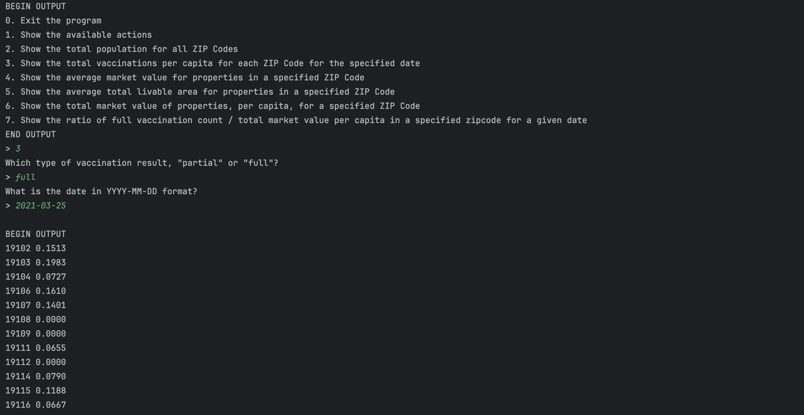
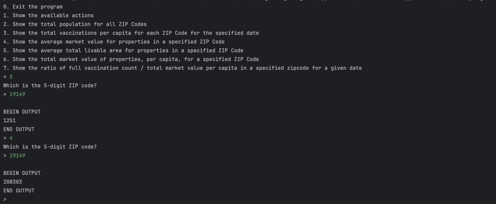
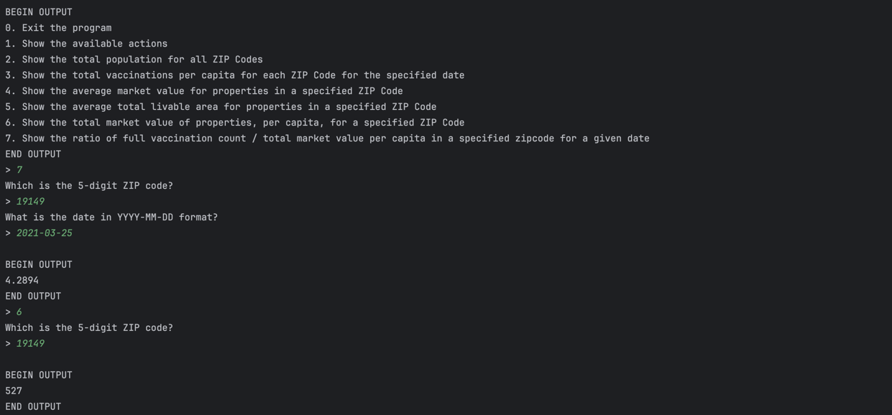

# Philly-Data-Explorer

## Quick Intro
* Designed a N-tier system with a menu-driven interface, which reads and analyzes Philadelphia’s population, property,
and COVID data from CSV and JSON files
* Employed state machine in CSV parser to handle complex format
* Built multi-class structure like analysis, processor, UI manager to handle menu selection and display result such as
showing vaccination per capita and average living area
* Recorded activities in singleton log
* Utlized inheritance and strategy interface to avoid code repeat

## How to run
Run with the following parameters:
```
--population=population.csv --covid=covid_data.json --properties=downsampled_properties.csv --log=log.txt
```

## Menu

*This shows total vaccinations per capita for each ZIP Code for the specified date*

*This shows average total livable area for properties in a specified ZIP Code*

*This shows ratio of full vaccination count / total market value per capita in a specified zipcode for a given date*
